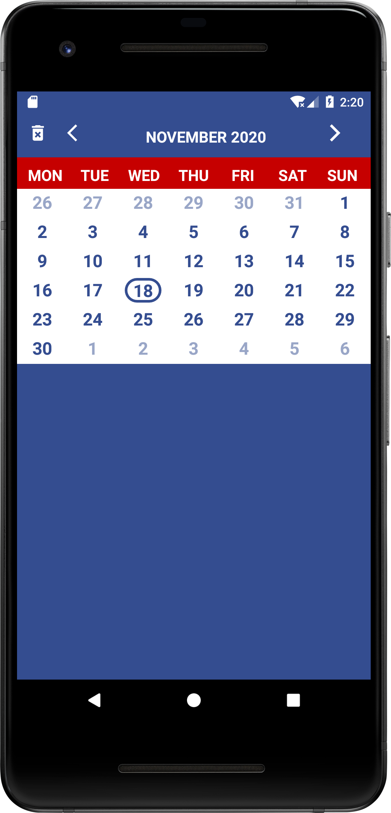
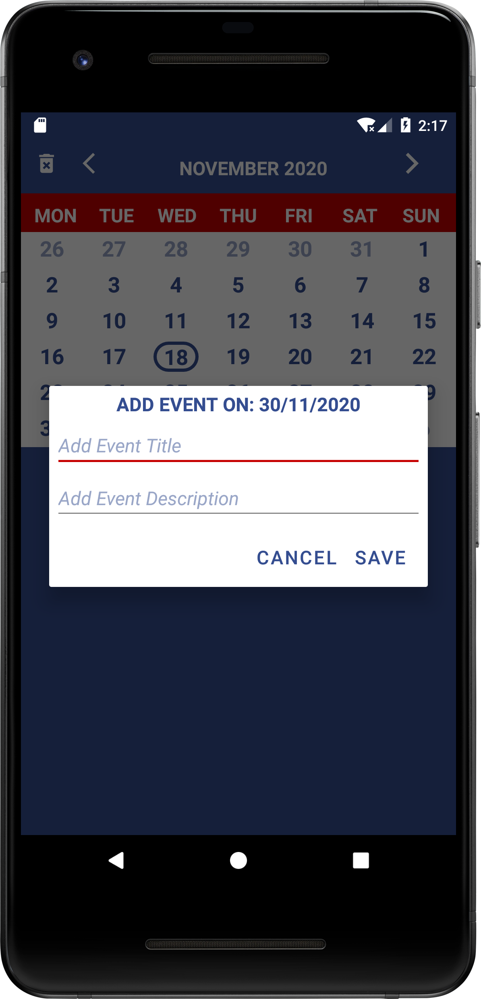
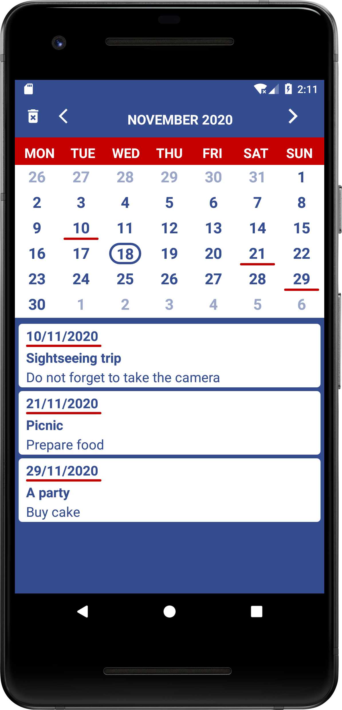
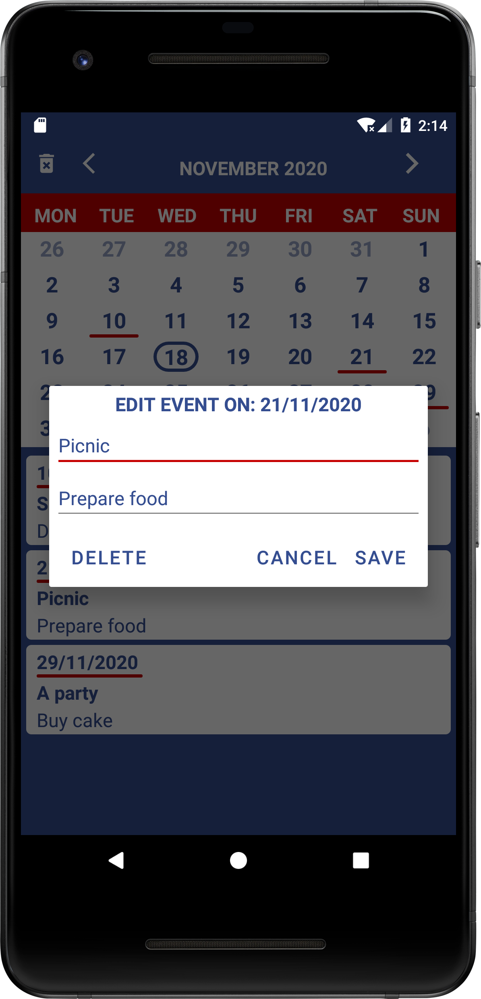

# Calendar
Custom calendar with events created in Android Studio

Click on date to add event.

Click on RecyclerView item to edit or delete event.

Click on Left ImageView or Right ImageView to open previous or next month.

Click on Delete ImageView to delete all events.

SQLiteDatabase to store events.

  

  
